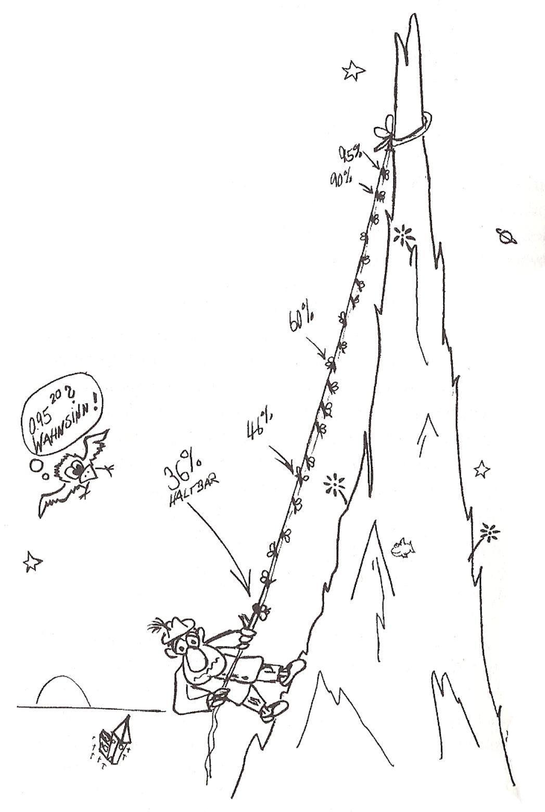
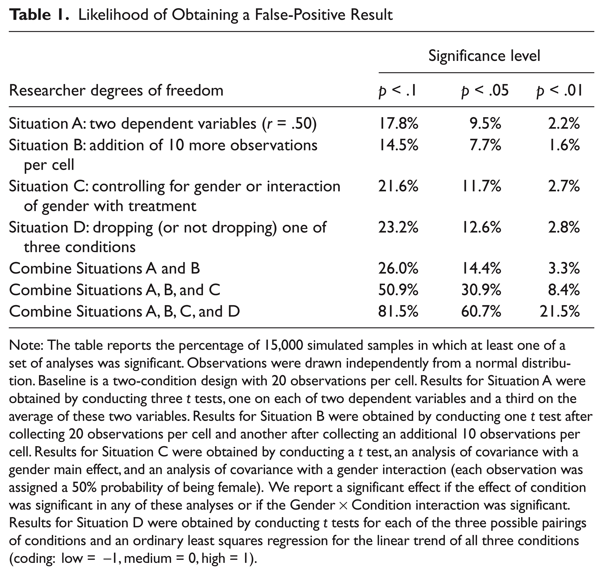

```{r setup, include=FALSE}
htmltools::tagList(rmarkdown::html_dependency_font_awesome())  ##
knitr::opts_chunk$set(echo = FALSE)
```


## Ablauf
<iframe src="timeline/timeline_prereg_ws.html" height=250px></iframe>   

## Intro {.nullneunem}
__Inhalte des Workshops:__

* Notwendigkeit der Präregistrierung:
     * Axiomatik des NHST
     * Resultierende Probleme
* Durchführung der Präregistrierung:
     * OSF: Möglichkeiten & Stolpersteine
     * OSF: Do it yourself
     
__Umsetzung des Workshops:__

* Gerne viel Eigenaktivität!
     * Produktive Heterogenität 😊
     * Hoffentlich nicht zu überformend
     
## Kurze Survey
Bitte beantworten Sie die Fragen auf [pollev.com/merk](pollev.com/merk)

<iframe src="https://www.polleverywhere.com/multiple_choice_polls/L2n1UmgoFf0YxUO" allowfullscreen></iframe>

# Weshalb präregistrieren?

## Das NHSTF
* NHSTF = Nullhypothesen Signifikanztest Framework  
* $\text{p-Wert} \equiv P[E|H_0]$ wobei $E$ als vorliegendes oder noch stärker gegen $H_0$ sprechendes empirisches Ereignis definiert wird [@Eid2013]
* Probleme:
     * Bewusstes Fehlverhalten wie "cherry-picking, data dredging, significance chasing, significance questing, selective inference, p-hacking" ... (hier außer Acht)
     * Inhaltsarmut: _"parody of falsificationism in which straw-man null hypothesis A is rejected"_ [@Gelman2016]
     * Multiple comparisons
     * Degrees of freedom [@Simmons2011]: _"This ‘what would have been done under other possible datasets’ is central to the definition of p-value.” The concern is [...] multiple potential comparisons." [@Gelman2016]_

## Multiple Comparisons
```{r, out.width="32%", fig.align='center',fig.cap="https://wikis.fu-berlin.de/display/fustat"}

```

## Freiheitsgrade I

Beispiele:

* Faktor- oder Summenscore?
* latent oder manifest?
* Cronbach oder McDonald?,
* mit neuem Item oder ohne?
* Operationalisierung A oder B?
* Imputationen oder FIML?
* Multivariat oder mehrfach univarat?
* 1-PL, 2-PL oder 3-PL?


## Freiheitsgrade II
Beispiel aus Simmons et al [-@Simmons2011]  

```{r, out.width="55%", fig.align='center'}

```

## Lösungsvorschlag I: [@Simmons2011] 
Requirements for authors

1. Authors must decide the rule for terminating data collection before data collection begins and report this rule in the article.
2. Authors must collect at least 20 observations per cell or else provide a compelling cost-of-data-collection justification.
3. Authors must list all variables collected in a study.
4. Authors must report all experimental conditions, including failed manipulations.
5. If observations are eliminated, authors must also report what the statistical results are if those observations are included.
6. If an analysis includes a covariate, authors must report the statistical results of the analysis without the covariate. 

## Lösungsvorschlag II: [@Simmons2012] 
21 word solution:

> _We report how we determined our sample size, all data exclusions (if any), all manipulations, and all measures in the study._

(auch Bestandteil des [Commitment to Research Transparency](http://www.researchtransparency.org/))

## Lösungsvorschlag III: Präregistrierung
* 8-Fragenversion von aspredicted.org
* Preregistration Challenge des OSF
* Vorschlag von van't Veer und Giner-Sorolla [@VantVeer2016]
* Vorschlag von Brandt et al [@Brandt2014]

## Arbeitsgruppen I (Tiere): Präregistrierungsformulare
Vorschläge für den Austausch:

* Welchen Forschungsarbeiten gehen Sie gerade nach?
* Welche Erfahrungen haben Sie bisher mit Präregistrierung gemacht?
* Welche Unterschiede zeigen die Präregistrierungsformulare?
* Welche praktischen oder theoretischen Fragen zur Präregistrierung haben Sie?
* Wie würde eine Präregistrierung für ihr aktuelles Vorhaben aussehen? Welche Schwierigkeiten würde diese Präregistrierung aufwerfen?

## Das OSF
* _"The OSF is a free, open source service of the Center for Open Science. We're aligning scientific practices with scientific values by improving openness, integrity and reproducibility of research"_ (https://osf.io)
* Open Science Cloud Framework mit Fokus auf
    * Workflow Management
    * File Sharing
    * Archivierung
    * (Prä-)Registrierung
* Umfassende Third-Party-Integration
     * <i class="fa fa-github"></i>, <i class="fa fa-dropbox"></i>, <i class="fa fa-google"></i>, <i class="fa fa-quote-right"></i>, ...

## Spezifische Open Science Features
* Lizenzierungen
* DOIs für Registrierungen
* PrePrint-Server
* Versionsmanagement
* Usage Analytics
* Wiki
* Sophistizierter API der programmatischen Zugriff erlaubt `{osfr}`, `{pyosf}`
* Anonymisierte View-Only-Links

## Frage- und Hands-On-runde OSF
* Haben Sie Fragen zum OSF?
* Wollen Sie gleich das OSF ausprobieren?
     * Registrieren
     * Demo-Projekte anlegen
     * Demo-Projekte testen
     * Third-Parties ausprobieren
     * Registration anlegen
     * View Only Links testen
     * `{osfr}` ausprobieren

## Arbeitsgruppen II (Pflanzen): Where to go next?
Diskussionsvorschläge:

* Wo sehen Sie in Ihrem konkreten Arbeitsumfeld Chancen und Probleme der Präregistrierung?
* Wo sehen Sie in Ihrem konkreten Arbeitsumfeld Katalysatoren und Stolpersteine für die Umsetzung von Präregistrierungen?


## Literatur {.nullsechsem}


